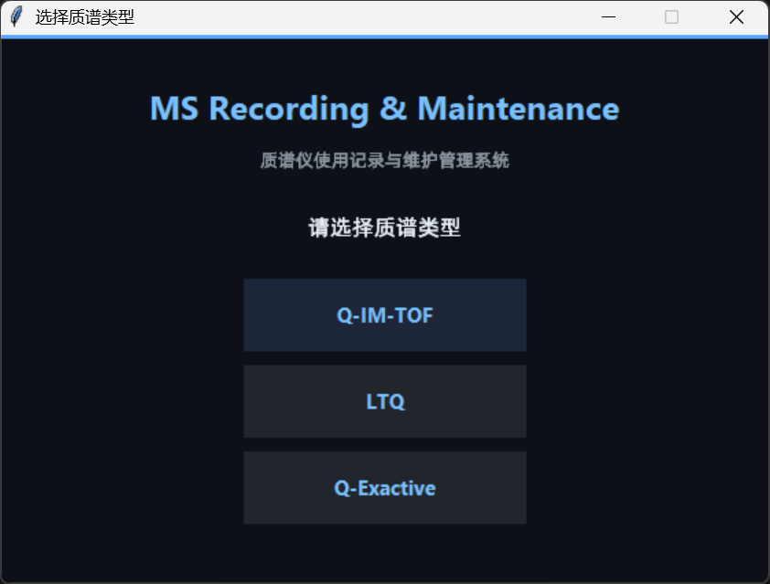
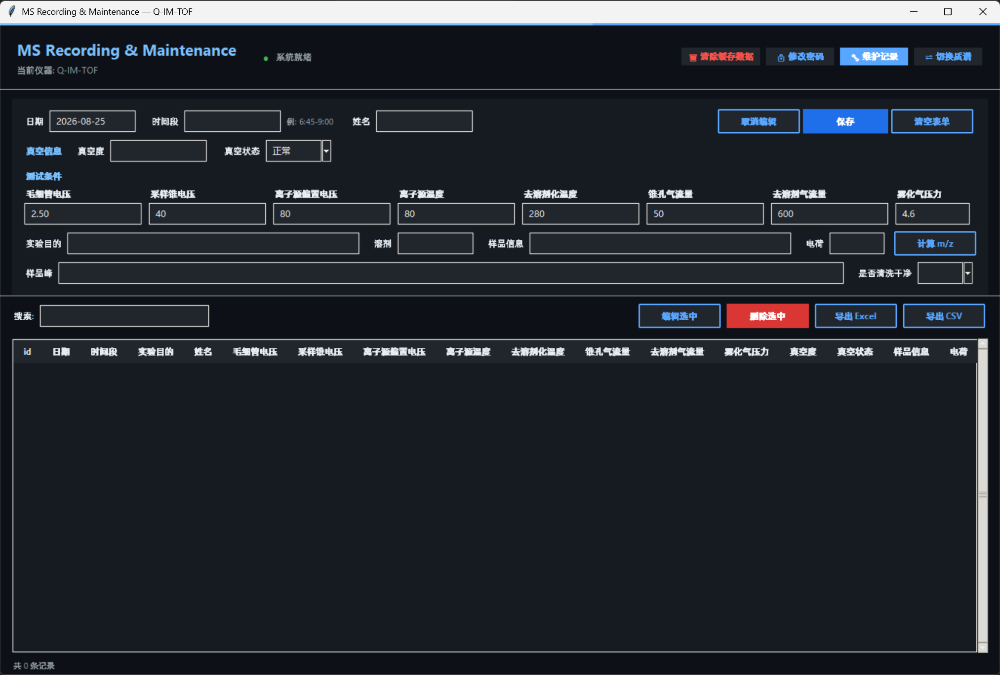
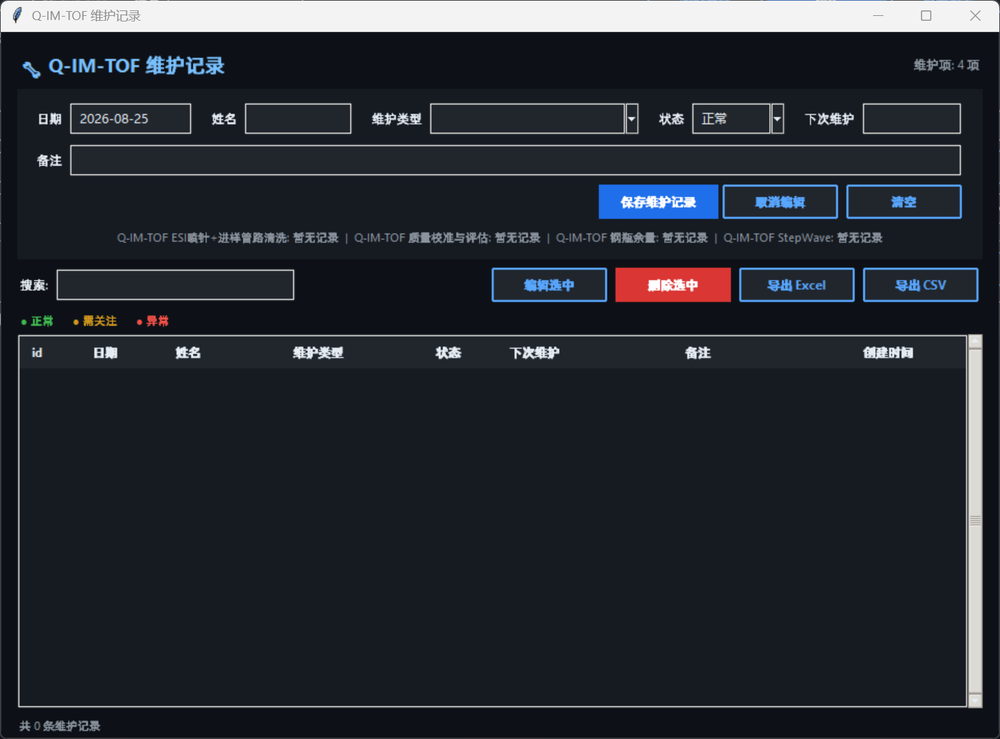

# MS Recording & Maintenance

> 质谱仪使用记录与维护管理系统 — 为课题组三台质谱仪（Q-IM-TOF / LTQ / Q-Exactive）提供统一的操作日志与维护计划管理。

[](https://www.python.org/)
[](LICENSE)
[]()

---

## 目录

- [功能特性](#-功能特性)
- [屏幕截图](#-屏幕截图)
- [快速开始](#-快速开始)
- [使用说明](#-使用说明)
- [数据库结构](#-数据库结构)
- [支持的质谱仪](#-支持的质谱仪)
- [从源码构建](#-从源码构建)
- [项目文件说明](#-项目文件说明)
- [数据与隐私](#-数据与隐私)
- [使用限制](#️-使用限制)
- [开发状态](#-开发状态)
- [贡献者](#-贡献者)
- [许可证](#-许可证)

---

## ✨ 功能特性

### 实验记录管理
- 📝 完整记录每次质谱实验信息：**日期、时间段、姓名、实验目的、溶剂、清洗状态、真空信息（真空度/真空状态）、测试条件、样品分子式、电荷、样品峰**
- 🧪 **测试条件按质谱类型动态切换**：Q-IM-TOF / LTQ / Q-Exactive 各有专属参数集，切换仪器后自动载入对应字段
- ⚗️ **分子式 m/z 自动计算**：内置完整元素周期表原子量数据库，支持任意复杂度分子式（含括号嵌套、水合物/加合物），输入分子式和电荷后一键计算 m/z
- 🔍 实时搜索筛选、列头排序、右键拖拽批量多选

### 维护记录管理
- 🔧 三种质谱仪各自预置维护类型及推荐周期
- 📅 选择维护类型后**自动计算下次维护日期**
- 🟢🟡🔴 维护状态可视化（正常 / 需关注 / 异常），表格行按状态着色，超期记录红色背景高亮
- 📊 显示各维护项**上次维护时间与周期对比**，一眼识别超期项目

### 数据导出
- 📤 实验记录 & 维护记录均支持**导出为 CSV 或 Excel（.xlsx）**
- 🎨 Excel 导出自动调整列宽、表头加粗，维护状态按颜色标注

### 数据安全
- 🔒 **管理员密码**：首次编辑/删除记录时引导设置，此后所有编辑、删除、清空操作均需验证身份（密码以 SHA-256 哈希存储）
- 🛡️ **数据防误删保护**：应用退出时自动将数据库与配置文件设为「隐藏 + 只读」属性（Windows），防止误删

### 用户体验
- 🌙 **深色主题**（GitHub Dark 风格），长时间使用不刺眼
- ⌨️ 键盘友好：Enter 在输入字段间跳转，Ctrl+S 快速保存，Ctrl+F 聚焦搜索
- 🔄 支持运行时切换质谱类型

---

## 📸 屏幕截图

> 以下为应用运行截图（点击图片可查看大图）

<p align="center">
  
  &nbsp;&nbsp;
  
</p>

<p align="center">
  
</p>

---

## 🚀 快速开始

### 方式一：使用已发布的预览版 exe

1. 前往 [Releases](https://github.com/Shiqi-Liu-chem/lab-mass-spec-maintenance/releases) 页面
2. 下载当前预发布版本中的 `MS_recording.maintenance.exe`
3. 双击运行即可，无需安装 Python 环境

> 📌 当前公开 exe 为 `v0.1.0-alpha` 预览版；仓库源码可能先于可执行文件更新。首次运行时需选择质谱类型，后续启动将自动记住上次选择。

### 方式二：从源码运行

**系统要求**：Python 3.8+

```bash
# 1. 安装依赖
pip install -r requirements.txt

# 2. 运行
python "MS_recording&maintenance.py"
```

### Windows 兼容性状态

| 版本 | 状态 | 获取方式 |
|------|------|----------|
| 当前 Windows 版本 | 源码持续更新；公开 exe 为 `v0.1.0-alpha` | 仓库源码 / Releases |
| Windows 7 x64 | 兼容构建已完成本地验证，正式发布包待重新构建 | 尚未公开发布 |
| Windows XP x86 | 离线兼容构建已完成本地验证，正式发布包待重新构建 | 尚未公开发布 |

旧系统构建环境、缓存和测试数据库不纳入 Git 仓库；通过最终验证后，只在 Releases 发布对应 ZIP 与 SHA256 校验值。

---

## 📖 使用说明

### 实验记录管理

1. 在主页面上方的表单区域依次填写：
   - **日期**（默认今天）、**时间段**（如 `6:45-9:00`）、**姓名**
   - **真空信息**（真空度、真空状态）
   - **测试条件**（每种质谱仪有默认值，切换仪器后自动变化）
   - **实验目的**、**溶剂**、**样品信息**（分子式）、**电荷**（如 `2+`, `1-`, `+3`）、**是否清洗干净**
2. 点击「**计算 m/z**」按钮，自动计算 m/z 值并填入「样品峰」字段
3. 点击「**保存**」或按 `Ctrl+S`

> 🔒 首次执行**编辑 / 删除**操作时，系统会引导设置管理员密码，此后相关操作均需验证身份。

### 分子式 m/z 计算

| 特性 | 说明 | 示例 |
|------|------|------|
| 常规分子式 | 直接书写 | `C6H12O6` |
| 括号嵌套 | 支持 `()`, `[]`, `{}` 多层嵌套 | `[Fe(CN)6]3-` |
| 水合物/加合物 | 用 `·` 或 `.` 连接 | `C6H12O6·H2O` |
| 电荷格式 | 灵活支持 | `2+`, `+2`, `1-`, `-1` |

### 维护记录管理

1. 点击右上角「**🔧 维护记录**」按钮进入维护管理页面
2. 在表单中填写：
   - **日期**、**姓名**（操作人员）
   - **维护类型**（下拉选择，每台仪器有专属维护项）
   - **状态**：正常 / 需关注 / 异常
   - **下次维护**：可点击「自动计算」根据推荐周期自动填充
   - **备注**：自由描述
3. 保存后，表格中会按状态着色，超期记录红色背景提醒
4. 底部显示各项维护的**上次时间和周期对比**，快速掌握维护进度

### 数据导出

- **CSV 导出**：选中表格行 → 点击「导出 CSV」
- **Excel 导出**：选中表格行 → 点击「导出 Excel」→ 自动调整列宽和格式
- 未选中记录时不会执行导出

### 快捷键

| 快捷键 | 功能 |
|--------|------|
| `Enter` | 跳转到下一个输入字段 |
| `Ctrl+S` | 保存当前记录 |
| `Ctrl+F` | 聚焦搜索框 |
| `双击记录` | 编辑该条记录 |
| `右键拖拽` | 批量选中多行 |

---

## 🗄 数据库结构

应用使用 SQLite 数据库（`ms_data.db`），含 `experiments`（实验记录）与 `maintenance`（维护记录）两张表，另有一份 JSON 配置文件（`ms_config.json`）。

Windows 下的数据保存在当前用户目录：

```text
%APPDATA%\MSRecordingMaintenance\ms_data.db
%APPDATA%\MSRecordingMaintenance\ms_config.json
```

从旧版便携式发布包升级时，如果程序目录中存在旧的数据库或配置文件，并且用户数据目录尚无对应文件，应用会自动复制旧文件；不会覆盖已有用户数据。升级前仍建议手动备份数据库。

### `experiments` 表 — 实验记录

| 字段 | 类型 | 说明 |
|------|------|------|
| `id` | INTEGER | 主键，自增 |
| `date` | TEXT | 实验日期（如 2025-01-15） |
| `time_period` | TEXT | 时间段（如 6:45-9:00） |
| `purpose` | TEXT | 实验目的 |
| `name` | TEXT | 操作者姓名 |
| `sample_info` | TEXT | 样品分子式 |
| `charge` | TEXT | 电荷信息 |
| `sample_peaks` | TEXT | 样品峰 m/z 值 |
| `solvent` | TEXT | 溶剂 |
| `cleaned` | TEXT | 是否清洗干净（是/否） |
| `vacuum_pressure` | TEXT | 真空度 |
| `vacuum_status` | TEXT | 真空状态（正常/需关注/异常） |
| `ms_type` | TEXT | 质谱类型 |
| `created_at` | TEXT | 创建时间（自动填充） |

> 测试条件按质谱类型拆分为多个动态字段（如毛细管电压、鞘气、喷雾电压等），同一物理参数在不同质谱间共用列。字段级说明见 [docs/data_model.md](docs/data_model.md)。

### `maintenance` 表 — 维护记录

| 字段 | 类型 | 说明 |
|------|------|------|
| `id` | INTEGER | 主键，自增 |
| `ms_type` | TEXT | 质谱类型 |
| `date` | TEXT | 维护日期 |
| `name` | TEXT | 维护人员姓名 |
| `record_type` | TEXT | 维护类型 |
| `status` | TEXT | 维护后状态（正常/需关注/异常） |
| `notes` | TEXT | 备注 |
| `next_date` | TEXT | 建议下次维护日期 |
| `created_at` | TEXT | 创建时间（自动填充） |

---

## 🔬 支持的质谱仪

| 质谱仪 | 维护项数量 | 维护周期范围 |
|--------|-----------|-------------|
| **Q-IM-TOF** | 4 项 | 30–180 天 |
| **LTQ** | 8 项 | 7–90 天 |
| **Q-Exactive** | 8 项 | 7–90 天 |

各类维护项详情（如 ESI 喷针清洗、质量校准、机械泵震气、更换泵油等）见应用内下拉菜单。

---

## 🔧 从源码构建

使用 PyInstaller 打包为 Windows 可执行文件：

```bash
# 安装 PyInstaller
pip install pyinstaller

# 使用 .spec 文件构建
pyinstaller "MS_recording&maintenance.spec"

# 输出在 dist/ 目录下
```

> `.spec` 文件已预先配置好 `--windowed`（无控制台窗口）和所需 hidden imports。

---

## 📁 项目文件说明

| 文件/目录 | 说明 |
|-----------|------|
| `MS_recording&maintenance.py` | 主程序源码（约 2200 行） |
| `MS_recording&maintenance.spec` | PyInstaller 构建配置 |
| `requirements.txt` | Python 依赖 |
| `docs/` | 应用截图与数据模型文档 |
| `sample_data/` | 脱敏示例数据 |
| `docs/data_model.md` | 数据库与配置文件字段说明 |
| `dist/` | 本地打包输出目录（由 Git 忽略；exe 通过 Releases 发布） |

---

## 🔒 数据与隐私

本公开仓库不包含任何真实实验记录、人员数据、仪器凭证或未发表的研究数据。截图与示例文件均使用脱敏或虚构内容。使用者应遵守所在机构的数据管理与仪器安全规范。

---

## ⚠️ 使用限制

- 本项目为课题组工作流原型，并非仪器厂商官方软件。
- 维护周期为可配置参考值，不能替代制造商手册或机构标准操作规程（SOP）。
- 升级前请备份本地数据库。

---

## 🚧 开发状态

> [!IMPORTANT]
> 本项目仍在积极开发中。核心的实验记录、维护追踪、搜索与数据导出功能已完成实现，量化验证与更广泛的兼容性测试仍在进行中。

### 当前进度

- [x] 核心实验与维护记录工作流已实现
- [x] CSV 与 Excel 导出已实现
- [x] Windows 可执行文件已打包
- [ ] 代表性记录的数据完整性验证
- [ ] 导出一致性测试
- [ ] 更多质谱仪型号兼容性测试
- [ ] 自动化回归测试

当前版本应视为早期功能原型，而非经过全面验证的生产系统。计划中的验证工作详见 [Issue #1](https://github.com/Shiqi-Liu-chem/lab-mass-spec-maintenance/issues/1)。

---

## 🏫 课题组主页

🏫 [中国科学院青岛生物能源与过程研究所 — 团簇化学与能源催化课题组](http://cluster.qibebt.ac.cn/)

欢迎访问课题组主页了解更多研究方向与最新成果。

---

## 👥 贡献者

感谢以下对本项目的贡献者：

- **Shiqi Liu** — 项目发起者、需求定义、测试与验证
- 联系方式：riixz17ya@gmail.com
- *（其他协作者待补充）*

---

## 🙏 致谢

- 本项目代码由 [Claude Code](https://claude.ai/code)（Anthropic AI 编程助手）辅助编写
- 需求与测试：[中国科学院青岛生物能源与过程研究所 — 团簇化学与能源催化课题组](http://cluster.qibebt.ac.cn/)

---

## 📄 许可证

本项目采用 [MIT License](LICENSE) 开源许可协议。

---

*Last updated: 2026-08-25*
